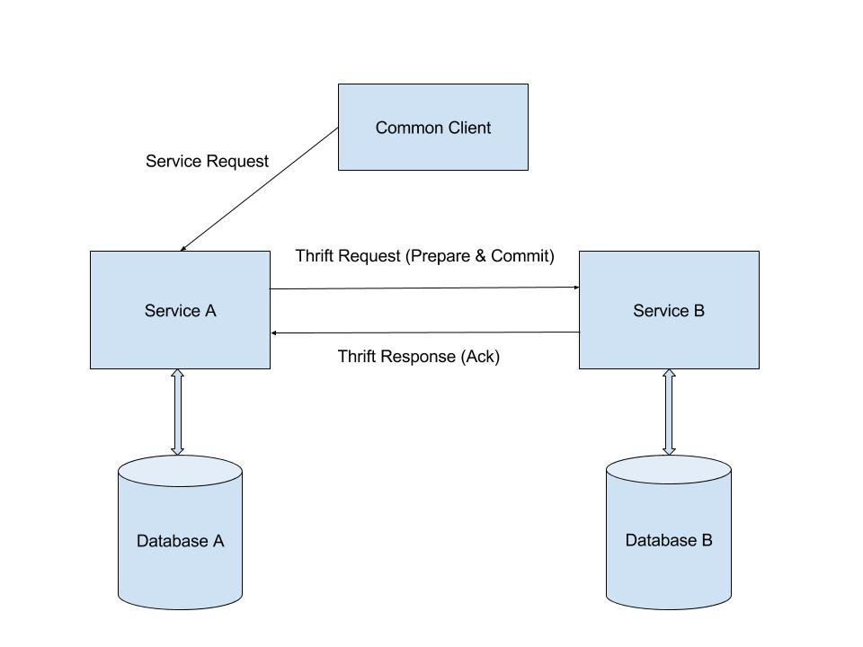

## Problem Statement:
- In a Distributed System which has microservices all performing certain tasks own a database. And each microservice alone has the authority over that database to make changes. But in cases of consistency all of them have to be in sync either immediately or eventually. Gourav and Ajinkya have worked on [Event-Driven Approach](https://gouravshenoy.github.io/apache-airavata/spring17/2017/04/20/final-report.html) which is eventual consistent approach. Considering a case where there may be need for immediate consistency we wanted to explore how to implement that in a distributed environment with just 2 microservices. 

## Possible Solutions:
- Two-Phase Protocol is to have immediate consistency. But it works really well in a single architecture. As the name suggests, there are two phases in this mechanism - Commit Request Phase and Commit Phase.
- Prepare request phase (also known as voting phase): The manager sends a query to commit message to all the services. The manager then waits for all the services to vote yes or no. Each of the services will perform the transaction up to the point where they would have to commit. The services reply with yes or an agreement if all they are prepared or no if even if one of the services is not prepared.
- Commit phase (also knows as completion phase): There can be two conditions here. Either the manager received yes from all the services or at least one of the services voted no.

- Manager received yes from all services: The manager sends a commit message to all the services asking them to commit the transaction. After the commit, the services send an acknowledgement to the manager after which the transaction is complete.

- Manager received no from one or more of the services: The manager sends a rollback message to all the services asking them to rollback to the state before the actions from the previous phase. After the rollback, the services send an acknowledgement to the manager after which the transaction is undone.

- In case of a distributed architecture there are 2 possible solutions to tackle this. Global Transaction Manager that has direct access to all the databases and it has the knowledge of the dependencies between the schema as explained in the diagram below. Each and every transaction should go through the Global Transaction Manager to complete:

- There is another architecture where there is no need for a Global Transaction Manager. This has thrift calls between the two services that communicates from Service A within a single transaction:

## Solution Evaluation:
- Both architectures have its disadvantages:
- Architecture - 1 is perfectly fine if we were to use one Manager to manage database and all services talk to the GTM to perform any sort of database operation. There are 2 flaws in this architecture, First: In a distributed architecture each microservice should be tightly coupled with it's database and it shouldn't access other manager to talk to it's own database. Second: Global Transaction Manager is a single point of failure hence maintenance, modification and availability all falls at one point.
- Architecture - 2 has dependency over syncing. In continuous deployment of services there may be a new database that comes with it. But before any operation all the database schemas should be in sync. With the immediate consistency over distributed microservice let's say there is a service that goes down then there will be a stall over all the database related operation. Also if there is a service that will be removed and a new instance of the same service is brought up or upgraded then there should be some kind of sync that should be performed with the new database to make sure that it is in the same level as other databases.

## Conclusion and Recommendation:
- Although Global Transaction manager promises Immediate Consistency it is not the right architecture to use in a distributed microservice. We need to look at a sync mechanism that should be present between 2 versions of the database. But if there are two tightly coupled services that are distributed but still want to be consisted I think the recommendation is to go with the second architecture. Two-phase commit with the second architecture should be in sync. For the sync of the new databases we can use Liquibase which will take the diff of the sql and we can export it as `.SQL` file to be run on other database. But the Service has to be blocked and should not go online until the database change has been made.
